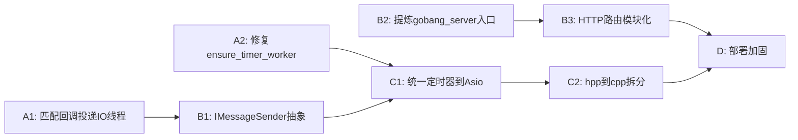

# 架构重审与重构执行记录（2026-06-11）

> **文档日期**: 2026-06-11  
> **来源计划**: `架构重审与重构执行计划_1c10fb44.plan.md`  
> **对照文档**: `架构评估与优化建议_6b01d118.plan.md`  
> **执行状态**: 阶段 A / B / C 核心项已落地；阶段 D 与部分 C2 项待后续

---

## 零、本次对话摘要

### 任务背景

M4 联调完成后，对 Online Gobang Battle 后端核心源码进行逐行架构重审，对照原《架构评估与优化建议》中 7 项待办逐项核验，并按优先级输出可执行重构方案。用户在本对话中要求**直接执行**该计划（阶段 A → B → C）。

审阅范围覆盖：`game.hpp`、`websocket_handler.hpp`、`matcher.hpp`、`connection_manager.hpp`、`room.hpp`、`online.hpp`、`matcher_interface.hpp`、`auth_handler.hpp`、`db.hpp`、`user_table.hpp`、`websocket_smoke.cpp`、`CMakeLists.txt`。

### 发现的问题

| 级别 | 问题 | 核心证据 |
|------|------|----------|
| P0-1 | 匹配回调在匹配线程直接执行 WebSocket 发送 | `matcher` 回调 → `on_match_success` → `conn_mgr_->send()`，非 IO 线程 |
| P0-2 | 双通道定时器（独立 worker 线程 + Asio 500ms 轮询） | `timer_worker_loop` 写队列，`process_timers` 消费队列 |
| P0-2 附 | `ensure_timer_worker` TOCTOU 竞态 | `if (running) return; running = true` 非原子 check-then-act |
| P1-1 | `GameController` 传递依赖 WebSocket++ | `game.hpp` → `connection_manager.hpp` → `websocketpp/server.hpp` |
| P1-2 | 大文件 header-only 导致编译膨胀 | `game.hpp` 712 行、`user_table.hpp` 760 行等 |
| P1-3 | 全局对象手动组装，smoke 即唯一入口 | `websocket_smoke.cpp` 中 9 个全局对象 + 内联 HTTP 路由 |

已确认修复项（重审前已完成）：`on_game_over` 末尾已调用 `room_mgr_->destroy_room(room_id)`，房间残留问题已关闭。

### 解决策略

按依赖关系分四阶段推进，本次执行 A / B / C：

```
A1(匹配回调投递IO) → B1(IMessageSender) → C1(Asio定时器)
A2(TOCTOU) ─────────────────────────────→ C1(一并消除worker)
B2(生产入口) → B3(HTTP路由模块化)
C1 → C2(hpp/cpp拆分，本次仅完成 game)
B3 + C2 → D(部署硬化，未执行)
```

- **并发**：匹配成功回调统一 `io_service.post` 到 IO 线程。
- **架构边界**：引入 `IMessageSender`，业务层不再感知 WebSocket++。
- **入口分离**：`gobang_server` 为生产入口，`websocket_smoke` 保留编译/绑定验证。
- **定时器**：采用方案一——`GameController` 注入 `IoService*`，每房间 `steady_timer` 自驱动；移除独立 worker 与超时队列轮询。
- **编译**：优先拆分 `game.hpp` → `game.cpp`，建立 `gobang_core` 静态库。

### 具体行动（已执行）

| 编号 | 行动 | 涉及文件 |
|------|------|----------|
| A1 | 匹配回调包装 `io_service.post` | `source/include/websocket_handler.hpp` |
| A2 | 移除 `timer_worker_` / `ensure_timer_worker`（随 C1 一并解决） | `source/include/game.hpp`, `source/src/game.cpp` |
| B1 | 新增 `IMessageSender`；`ConnectionManager` 实现接口；`GameController` 改依赖接口 | `message_sender.hpp`, `connection_manager.hpp`, `game.hpp`, `game.cpp` |
| B2 | 新建生产入口 `gobang_server` | `source/app/server_main.cpp`, `CMakeLists.txt` |
| B3 | HTTP 路由抽离 | `source/include/http_router.hpp` |
| C1 | Asio `steady_timer` 替代双通道定时器；`init()` 注入 `IoService*` | `asio_timer_types.hpp`, `game.hpp`, `game.cpp`, `server_main.cpp`, `websocket_smoke.cpp` |
| C1 附 | `process_timers()` 仅保留断线 grace；移除 500ms 超时轮询 | `websocket_handler.hpp`, `server_main.cpp`（仅保留 grace 驱动） |
| C2 | `game.hpp` 声明 + `game.cpp` 实现；新增 `gobang_core` 静态库 | `source/src/game.cpp`, `CMakeLists.txt` |
| 测试 | 适配新定时器与接口 | `test_game.cpp`, `test_websocket_game.cpp` |

### 完成结果

| 待办 | 计划状态 | 实际结果 |
|------|----------|----------|
| A1 匹配回调 io_service.post | pending → | **已完成** |
| A2 ensure_timer_worker TOCTOU | pending → | **已完成**（worker 机制整体移除，问题不再存在） |
| B1 IMessageSender 解耦 | pending → | **已完成** |
| B2 gobang_server 生产入口 | pending → | **已完成** |
| B3 HTTP 路由模块化 | pending → | **已完成** |
| C1 统一定时器到 Asio | pending → | **已完成** |
| C2 hpp/cpp 渐进拆分 | pending → | **部分完成**（仅 `game`；`websocket_handler` / `matcher` / `user_table` 待后续） |
| M4 E2E 验收 | pending | **未执行**（需 Linux 环境 + 浏览器联调） |
| M6 部署硬化（阶段 D） | pending | **未执行** |

**新增/变更的关键路径：**

- 生产启动：`./bin/gobang_server`（`source/app/server_main.cpp`）
- Smoke 测试：`./bin/websocket_smoke`（精简为组装 + 端口绑定验证）
- 核心库：`gobang_core`（`source/src/game.cpp`）

**本地验证情况：** 开发机为 Windows，无 WSL，未能在此环境完成 CMake 编译与 CTest。需在 Rocky/Ubuntu 环境执行：

```bash
cd source && mkdir -p build && cd build
cmake .. -DCMAKE_BUILD_TYPE=Debug
make -j$(nproc)
ctest --output-on-failure -R "test_game|test_websocket_game|websocket_smoke"
```

---

## 一、审阅方法与依据

本次重审基于以下完整源码的逐行阅读（重审时点行数，重构后 `game.hpp` 已缩减为声明头）：

| 文件 | 行数（审阅时） | 职责 |
|------|----------------|------|
| `source/include/game.hpp` | 712 | GameController 核心 |
| `source/include/websocket_handler.hpp` | 683 | WS 事件分发 |
| `source/include/matcher.hpp` | 413 | 匹配引擎 |
| `source/include/connection_manager.hpp` | 121 | 连接管理 |
| `source/include/room.hpp` | 420 | 房间与棋盘 |
| `source/include/online.hpp` | 73 | 在线四态 |
| `source/include/matcher_interface.hpp` | 70 | 匹配抽象 |
| `source/include/auth_handler.hpp` | 168 | 认证 |
| `source/include/db.hpp` | 228 | 数据库连接池 |
| `source/include/user_table.hpp` | 760 | 用户 DAL |
| `source/tests/websocket_smoke.cpp` | 319 | 运行入口/smoke |
| `source/CMakeLists.txt` | 241 | 构建 |

---

## 二、原计划待办状态核验

| 序号 | 待办项 | 重审时状态 | 代码核验 / 执行后状态 |
|------|--------|------------|----------------------|
| 0 | `on_game_over` 销毁房间 | completed | **已确认修复** |
| 1 | M4 E2E 验收 | pending | 需 Linux 环境，代码层面无阻塞 |
| 2 | 匹配回调 `io_service.post` | pending → | **已修复（A1）** |
| 3 | 提炼 `gobang_server` 入口 | pending → | **已完成（B2）** |
| 4 | `IMessageSender` 抽象解耦 | pending → | **已完成（B1）** |
| 5 | 统一定时器到 Asio | pending → | **已完成（C1）** |
| 6 | M6 部署硬化 | pending | 未开始（阶段 D） |

---

## 三、深度问题分析（源码级证据）

### P0-1: 匹配回调跨线程执行 WebSocket 操作（并发竞态）

**原调用链：**

```
matcher.hpp:403  _match_callback(result)          [匹配线程]
  -> websocket_handler.hpp:562  on_match_success()  [匹配线程]
    -> game.hpp:125  handle_game_start()              [匹配线程]
      -> conn_mgr_->send(...)                           [匹配线程]
      -> start_timeout_timer(room_id)                   [匹配线程]
    -> websocket_handler.hpp:588/605  _conn_mgr->send() [匹配线程]
```

`ConnectionManager::send()` 内部调用 `_server->send()`，WebSocket++ 官方建议所有 IO 操作在 `io_service` 线程执行。组合操作（建房 + 改在线态 + 发消息 + 启定时器）的原子性亦无法保证。

**风险等级：高** → **已通过 A1 消除**。

### P0-2: 双通道定时器机制

**原通道 A** — `GameController` 独立线程：`timer_worker_loop()` → 写 `timeout_queue_` / `disconnect_timeout_queue_`

**原通道 B** — `websocket_smoke.cpp` 500ms Asio 轮询 → `process_timers()` → `process_pending_timeouts()`

两套机制可协作，但维护成本高；`ensure_timer_worker()` 存在 TOCTOU：

```cpp
void ensure_timer_worker() {
    if (timer_worker_running_) { return; }  // 非原子 check-then-act
    timer_worker_running_ = true;
    timer_worker_ = std::thread(...);
}
```

**已通过 C1 消除**：改为每房间 `steady_timer`，到期直接在 IO 线程回调 `on_turn_timeout` / `on_disconnect_timeout`。

### P1-1: GameController 对 WebSocket++ 的传递依赖

原依赖路径：`GameController → ConnectionManager → websocketpp`

**已通过 B1 切断**：`GameController` 仅依赖 `IMessageSender*`，不再 include `connection_manager.hpp`。

### P1-2: Header-only 大文件编译膨胀

| 文件 | 行数 | 拆分状态 |
|------|------|----------|
| `user_table.hpp` | 760 | 待拆分 |
| `game.hpp` | 712 → ~86 | **已拆分** → `src/game.cpp` |
| `websocket_handler.hpp` | 683 | 待拆分 |
| `matcher.hpp` | 413 | 待拆分 |

### P1-3: 全局对象组装方式

原 `websocket_smoke.cpp` 承载 9 个全局对象 + HTTP 路由 + 信号处理 + 事件循环。

**已改善**：生产逻辑迁入 `server_main.cpp`；smoke 精简；HTTP 路由独立为 `HttpRouter`。全局组装模式仍存在，多实例/可配置组装留待后续（如引入 `ServerContext` 结构体）。

---

## 四、分阶段重构方案与落地对照

### 阶段 A: 并发安全修复

#### A1: 匹配回调投递到 IO 线程 ✅

```cpp
// websocket_handler.hpp — WebSocketHandler::init()
_matcher->set_match_callback([this](const MatchResult& result) {
    if (_server) {
        _server->get_io_service().post([this, result]() {
            this->on_match_success(result);
        });
    } else {
        this->on_match_success(result);
    }
});
```

验证：`test_websocket_game`、浏览器 E2E（待 Linux 执行）。

#### A2: 修复 `ensure_timer_worker` TOCTOU ✅

原计划用 `compare_exchange_strong`；实际执行 C1 时**直接移除** worker 线程，TOCTOU 根因消除。

---

### 阶段 B: 架构边界加固

#### B1: 引入 IMessageSender 接口 ✅

新建 `source/include/message_sender.hpp`：

```cpp
class IMessageSender {
public:
    virtual bool send(int64_t user_id, const std::string& msg) = 0;
    virtual void broadcast(int64_t uid1, int64_t uid2, const std::string& msg);
    virtual ~IMessageSender() = default;
};
```

- `ConnectionManager` 继承 `IMessageSender`
- `GameController::init(..., IMessageSender* sender, ...)`
- 组装侧仍传入 `&g_conn_mgr`，类型兼容

#### B2: 提炼生产入口 gobang_server ✅

- 新建 `source/app/server_main.cpp`
- `CMakeLists.txt` 新增 `gobang_server` 目标
- `websocket_smoke.cpp` 精简为编译检查 + 端口绑定

#### B3: HTTP 路由模块化 ✅

新建 `source/include/http_router.hpp`，承载 `/api/v1/auth/register`、`/api/v1/auth/login` 及 CORS 预检。

---

### 阶段 C: 统一定时器与编译优化

#### C1: 统一定时器到 Asio ✅

采用**方案一**（推荐）：

- `GameController::init(..., IoService* io_service = nullptr)`
- 每房间 `steady_timer`（`expires_from_now`，兼容旧版 Asio）
- 到期回调 `on_turn_timeout` / `on_disconnect_timeout` → `on_game_over`
- 移除：`timer_worker_`、`timer_cv_`、超时队列、`process_pending_timeouts`
- `server_main.cpp` 仅保留 500ms 驱动用于 **断线 grace**（`flush_pending_disconnects`），不再驱动游戏超时

`init()` 调用示例：

```cpp
g_game_ctrl->init(&g_room_mgr, &g_online_mgr, &g_conn_mgr, &g_user_table,
                  &g_server.get_io_service());
```

#### C2: 渐进 hpp → cpp 拆分 ⏳ 部分完成

| 优先级 | 文件 | 状态 |
|--------|------|------|
| 1 | `game.hpp` → `game.cpp` | ✅ 已完成，纳入 `gobang_core` |
| 2 | `websocket_handler.hpp` | ⏳ 待后续 |
| 3 | `matcher.hpp` | ⏳ 待后续 |
| 4 | `user_table.hpp` | ⏳ 待后续 |

保留 header-only：`online.hpp`、`matcher_interface.hpp`、`connection_manager.hpp`（体量小，拆分收益低）。

---

### 阶段 D: 部署与安全加固（未执行）

- systemd unit 模板
- Nginx WSS 反向代理配置
- CORS Origin 白名单（替换 `Access-Control-Allow-Origin: *`）
- `GET /health` 健康检查端点
- 前端 `config.js` 外置 WS_URL

---

## 五、重构依赖关系



---

## 六、风险评估与建议

- **A1** 是最小改动最高收益项：1 处 lambda，消除最大并发隐患 → **已落地**
- **B1** 应在 A1 之后立即执行：`IMessageSender` 是后续重构基石 → **已落地**
- **C1 与 C2** 可并行：定时器统一和文件拆分无直接冲突 → C1 完成，C2 完成 game 部分
- **不建议现在做**：微服务化、Redis/Kafka、C++17 全面升级、房间 DB 持久化

---

## 七、预期收益与实际收益

| 改动 | 消除的风险/改善 | 计划工作量 | 实际状态 |
|------|-----------------|------------|----------|
| A1 匹配回调投递 | P0 并发竞态 | 0.5 天 | ✅ |
| A2 TOCTOU 修复 | 边界竞态 | 0.5 小时 | ✅（随 C1 消除） |
| B1 IMessageSender | 架构边界恢复 | 1 天 | ✅ |
| B2 生产入口 | 部署与测试分离 | 1 天 | ✅ |
| B3 HTTP 路由 | 模块化 | 0.5 天 | ✅ |
| C1 统一定时器 | 简化并发模型 | 1-2 天 | ✅ |
| C2 hpp/cpp 拆分 | 编译时间下降 30%+ | 2-3 天 | ⏳ 约 25%（仅 game） |

---

## 八、后续待办

1. **Linux 回归**：`test_game`、`test_websocket_game`、`websocket_smoke` + 浏览器 M4 E2E
2. **C2 续拆**：`websocket_handler` → `websocket_handler.cpp`（次优先）
3. **P1-3 深化**：将全局对象封装为 `ServerContext`，支持测试夹具多配置组装
4. **阶段 D**：部署硬化与安全项（M6）
5. **文档同步**：更新 `project_plan_v2.2.md` 中「服务入口」描述（`gobang_server` 已可用）

---

## 九、变更文件清单（本次对话）

**新增：**

- `source/include/message_sender.hpp`
- `source/include/asio_timer_types.hpp`
- `source/include/http_router.hpp`
- `source/src/game.cpp`
- `source/app/server_main.cpp`

**修改：**

- `source/include/game.hpp`（声明头，~86 行）
- `source/include/connection_manager.hpp`
- `source/include/websocket_handler.hpp`
- `source/tests/websocket_smoke.cpp`
- `source/tests/test_game.cpp`
- `source/tests/test_websocket_game.cpp`
- `source/CMakeLists.txt`
